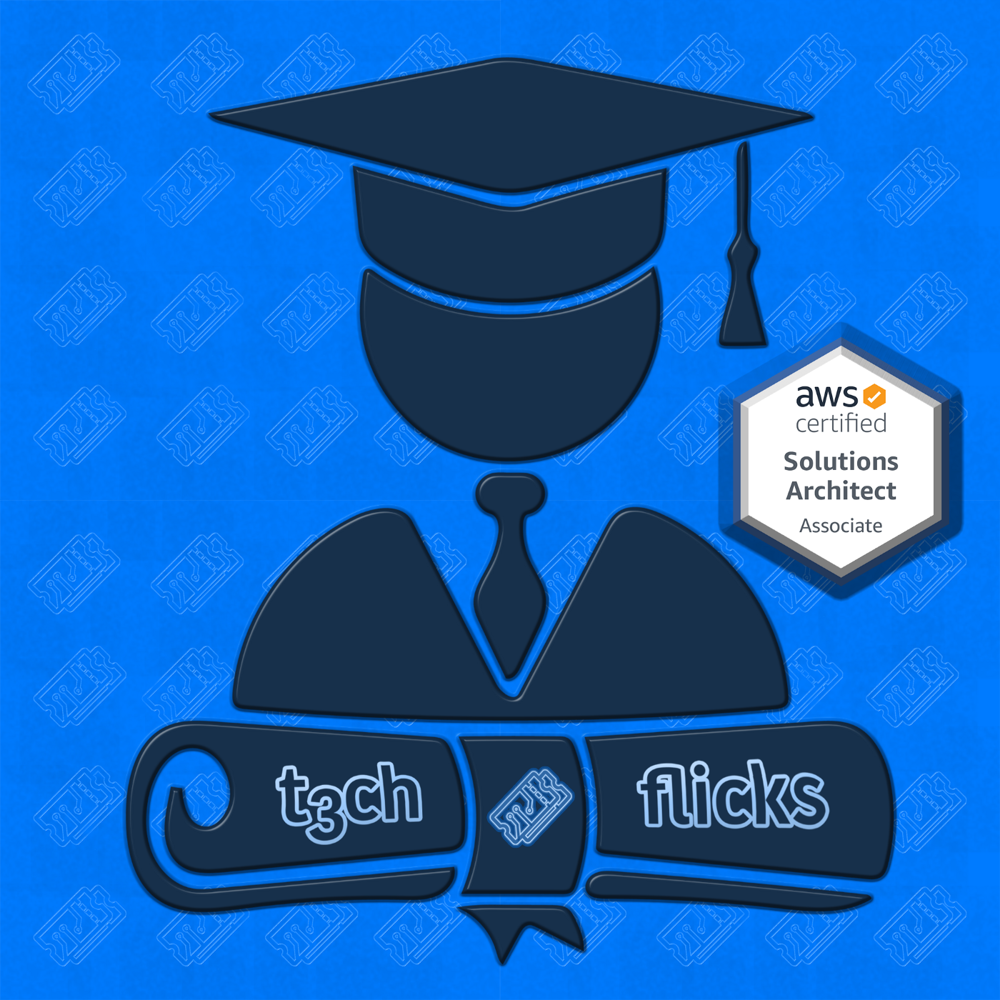

# [T3chFlicks](https://t3chflicks.org): AWS Solutions Architect

> A series of blog posts and quizzes for the AWS Solutions Architect Exam.

## `Tutorials`
## 1. VPC, Load Balancing, CloudWatch and AutoScaling

## 2. S3, EC2, EBS

## 3. CloudFront, ElastiCache

## 4. SQS, SNS

## 5. DNS and Route53

## 6. IAM

